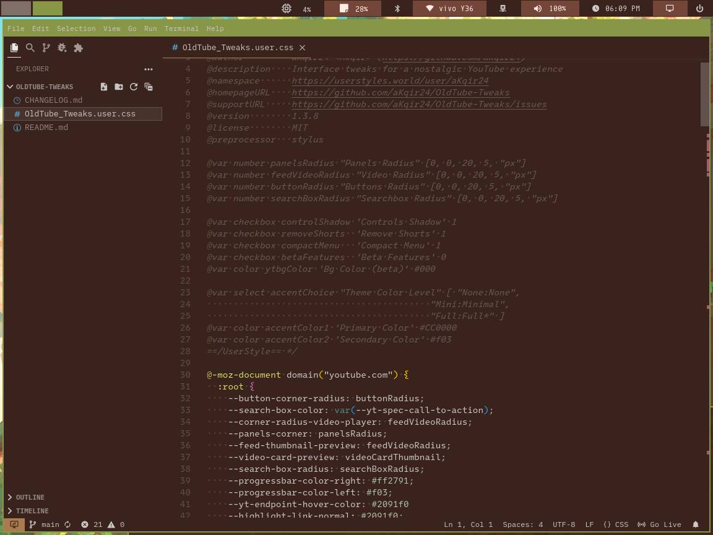
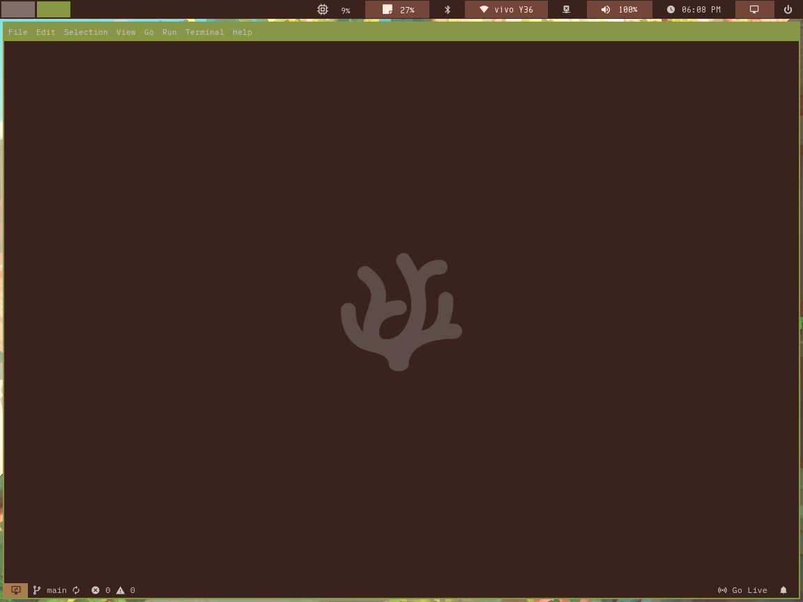

# vscodium-config


It includes the extensions and the `settings.json` config in my vscodium programming environment.

|   **Workspace**                   |   **Welcome**                   |
|-----------------------------------|---------------------------------|
|  |  |

# Installation
> [!note]
> You must put it in a dotfiles folder before using. Or you can copy it manually by copying the `.vscode-oss` and `.config` to `$HOME`.

```bash
    # When it is a submodule in your dotfiles
    stow -d [where you put the repo] -t ~ --adopt vscodium

    # When using my dotfiles
    stow -d resources/global.config/ -t ~ --adopt vscodium
```
